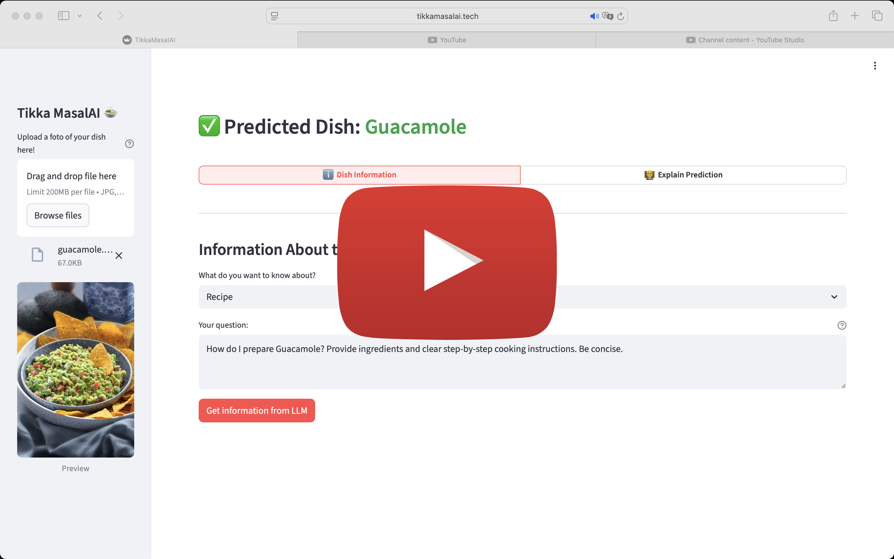

# Tikka MasalAI

<a target="_blank" href="https://cookiecutter-data-science.drivendata.org/">
        
</a>

A project for food classification using computer vision techniques, focussing on MLOPS best practices.

## Overview
- A full-stack project for Food-101 classification with automated training, evaluation, and deployment tooling.
- End-to-end computer vision workflow: dataset cleaning, training, evaluation, explainability, and MLflow tracking.
- Reproducible FastAPI backend + Streamlit frontend, both dockerized and wired through Docker Compose.
- Lightweight LLM assistant via Ollama (`gemma3:270m`) to augment explanations.
- Automated docs (Redoc + MkDocs), Bruno-powered API tests, and GH Actions CI/CD with multi-arch image builds.
- DVC-managed datasets and GCS-hosted model artifacts for consistent dev/prod parity.
- We use a Makefile which contains many useful commands. Run `make help` to get an overview of them.

## Demo Video
<p align="center">
    <a href="https://youtu.be/U_t5B0_oh4Q" target="_blank">
        
    </a>
</p>

## Links
- You can access our website at [tikkamasalai.tech](https://tikkamasalai.tech).
- Development docs live at [mlops-2526q1-mds-upc.github.io/TikkaMasalAI](https://mlops-2526q1-mds-upc.github.io/TikkaMasalAI/).

## Architecture at a Glance
- **Backend** (`src/backend`): FastAPI service exposing `/predict`, `/predict/explain`, `/llm/*`, metrics, and dashboards. Models are downloaded during Docker builds.
- **Frontend** (`src/frontend`): Streamlit UI for uploads, predictions, and explainability overlays powered by the backend API.
- **LLM Helper**: Ollama container seeded with `gemma3:270m` via a one-shot init job; surfaced through `/llm/generate`.
- **Training & Eval** (`src/train`, `src/eval`): Hugging Face + PyTorch fine-tuning scripts, MLflow logging, SHAP QA helpers, and preconfigured YAML configs under `configs/`.
- **Tooling**: DVC for data, Bruno for API tests, Ruff for lint/format, MkDocs for documentation, Docker/Compose for local+remote orchestration.

Mermaid diagram + deployment details live in [`docs/docs/development/containers.md`](docs/docs/development/containers.md).

## Repository Layout
```
├── configs/                # Training presets (default, production, quick)
├── data/raw/food101        # (Optional) Local copy managed via DVC
├── docs/                   # MkDocs site + development guides
├── reports/                # Coverage, carbon viz, SHAP exports
├── src/
│   ├── backend/            # FastAPI app, routers, schemas, Dockerfile
│   ├── frontend/           # Streamlit app + Dockerfile
│   ├── train/              # Fine-tuning entrypoints (ResNet-18, etc.)
│   ├── eval/               # Unified eval, SHAP QA, Deepchecks
│   └── models/             # Food classification model abstractions
├── tests/                  # Pytest suites (unit + backend/frontend packages)
└── tikkamasalai-requests/  # Bruno collections + env files
```

## Quick Start (registry images)
1. Make sure to be a member of the `mlops-2526q1-mds-upc` GitHub Organization.
2. Generate a GitHub Personal Access Token with at least `read:packages` scope. You can do so in the developer settings page of your GitHub account.
3. Set the token by running `export GHCR_PAT=ghp_...`
4. Log in once by running `echo $GHCR_PAT | docker login ghcr.io -u <github-username> --password-stdin` (or enter the token interactively).
5. Make sure you have Docker running.
6. Run `make compose-up`, then wait for the images to be pulled.
7. Access the application at http://localhost:8501.

## Contributing
### Prerequisites
- [uv](https://docs.astral.sh/uv/getting-started/installation/) (Python 3.10 runtime + dependency manager)
- Python 3.10 (uv can install it: `uv python install 3.10`)
- [Docker + Docker Compose](https://docs.docker.com/engine/install/) (for local stack and deployment parity)
- Node.js ≥ 20 (Redoc CLI for API docs)
- [Bruno CLI](https://www.usebruno.com/downloads) (`bru`) for API regression tests
- DVC remote credentials (contact the team to get them) to pull large datasets
- Have [gcloud cli](https://docs.cloud.google.com/sdk/docs/install-sdk) installed

### Environment Setup
```bash
# 1) Create venv
uv venv

# 2) Activate (zsh/macOS)
source .venv/bin/activate

# 3) Install deps
uv sync
```

### Data (DVC)
```bash
# configure credentials (replace placeholders)
uv run dvc remote modify origin --local access_key_id YOUR_ACCESS_KEY
uv run dvc remote modify origin --local secret_access_key YOUR_SECRET_ACCESS_KEY

# pull tracked artifacts
uv run dvc pull
# or use the Make target after configuring credentials
make dvc-pull
```

### GCP Credentials (required for Docker builds)
The backend Dockerfile downloads model artifacts during the build. If authentication fails, the build now stops immediately, so follow this once per workstation:

1. Authenticate and target the project:
   > You need IAM rights (Project Editor or better) on this GCP project to complete the remaining steps. If you do not have access yet, contact Adrian and request to be added before proceeding.
    ```bash
    gcloud auth login
    gcloud config set project academic-torch-476716-h3
    ```
2. Ensure the service account exists (**skip if this throws the error that the service account already exsists**):
    ```bash
    gcloud iam service-accounts create tikka-backend --display-name="Tikka Backend CI"
    ```
3. Grant it read access to the model bucket (add more roles if you store models elsewhere):
    ```bash
    gcloud projects add-iam-policy-binding $(gcloud config get-value core/project) \
      --member="serviceAccount:tikka-backend@$(gcloud config get-value core/project).iam.gserviceaccount.com" \
      --role="roles/storage.objectViewer"
    ```
4. Create the key in the location Compose expects, then lock it down:
    ```bash
    gcloud iam service-accounts keys create "$HOME/.config/gcloud/application_default_credentials.json" \
      --iam-account="tikka-backend@$(gcloud config get-value core/project).iam.gserviceaccount.com"
    chmod 600 "$HOME/.config/gcloud/application_default_credentials.json"
    ```
5. Export the env var (add to your shell profile for persistence):
    ```bash
    export GOOGLE_APPLICATION_CREDENTIALS="$HOME/.config/gcloud/application_default_credentials.json"
    ```

### Verification
(Optional) You can now verify that everything is correctly installed by running `make lint && make test` and running the workflows below.

### General Guidelines
We follow the guidance in [CONTRIBUTING.md](CONTRIBUTING.md): conventional commits, descriptive PR titles, Ruff formatting, complete test coverage, and documentation updates for user-facing changes.

## Running the Stack
### Local development (build images locally)
```bash
make local-up      # build backend/frontend Dockerfiles + start Ollama helper
make local-logs    # tail logs (Ctrl+C to exit)
make local-down    # stop and clean up
```
- Ports: backend `:8000`, frontend `:8501`, Ollama `:11434` (loopback bound).
- Mounts `src/frontend/.streamlit/secrets.toml` if present; never commit secrets.

### Individual Docker targets
- Build/run frontend: `make build-frontend-docker`, `make run-frontend-docker`
- Build/run backend: `make build-backend-docker`, `make run-backend-docker`

## Backend (FastAPI)
- Source: `src/backend`
- Key routes:
    - `POST /predict`: classify a multipart `image`
    - `POST /predict/explain`: saliency heatmap + metadata
    - `POST /llm/generate` & `GET /llm/health`: proxy to Ollama for textual explanations
    - `GET /health`, `GET /metrics`, `GET /dashboard`
- Generate OpenAPI + Redoc:
    ```bash
    make api-docs          # refresh src/backend/openapi.json + docs/docs/api.html
    make docs-build        # build MkDocs site (strict)
    make docs-serve        # serve locally at http://127.0.0.1:8001
    make docs              # build then serve (blocks until Ctrl+C)
    ```
- API Regression (Bruno):
    ```bash
    make test-local-api      # against local stack
    make test-deployed-api   # against remote env (configure env file first)
    ```

## Frontend (Streamlit)
- Code lives under `src/frontend`.
- Talks to the backend exposed via `API_URL` in `src/frontend/.streamlit/secrets.toml`.
- Run locally through Docker (`make run-frontend-docker`) or start the full stack via Compose to ensure Ollama + backend are healthy.

## Training & Evaluation
- Fine-tune ResNet-18 (quick run). Note that this might ask for your system password as it executeds a `sudo` command in the background.:
    ```bash
    uv run -m src.train.finetune_resnet18 --epochs 2 --train_samples 1000 --eval_samples 200 --output_dir models/resnet18-food101-2e-1k
    ```
- Config-driven runs:
    ```bash
    uv run -m src.train.finetune_resnet18 --config configs/training_quick.yaml
    uv run -m src.train.finetune_resnet18 --config configs/training_default.yaml --epochs 5
    ```
- Unified evaluation (logs to MLflow on DagsHub):
    ```bash
    make eval                            # uv run src/eval/eval.py
    uv run -m src.eval.eval --resnet_model_path models/resnet18-food101-2e-1k
    uv run -m src.eval.shap_qa --model resnet18 --model-path models/resnet18-food101-2e-1k
    ```

### Available Models
1. **Food-101-93M** (benchmark) – [Hugging Face](https://huggingface.co/prithivMLmods/Food-101-93M), ~90% accuracy
2. **ResNet-18** (base) – [Microsoft](https://huggingface.co/microsoft/resnet-18), fine-tuned on Food-101
3. **VGG-16** (alt base) – [Torchvision docs](https://docs.pytorch.org/vision/main/models/generated/torchvision.models.vgg16.html)

Add models by subclassing [`src/models/food_classification_model.py`](src/models/food_classification_model.py) and placing new implementations in `src/models/`.

## Testing & Quality Gates
- `make lint` → `ruff format --check` + `ruff check`
- `make format` → auto-fix lint issues + format
- `make test` → full pytest suite (via uv)
- `make test-backend` → backend-only tests
- `make code-coverage` → open HTML coverage report in `reports/coverage/index.html`
- Bruno API suites: `make test-local-api`, `make test-deployed-api`

## Documentation
- Authoritative developer docs live in [`docs/docs`](docs/docs) and are published via [GitHub Pages](https://mlops-2526q1-mds-upc.github.io/TikkaMasalAI/).
- MkDocs workflow:
    ```bash
    make docs-build     # build once (outputs to docs/site)
    make docs-serve     # live reload server at http://127.0.0.1:8001
    make docs           # build + serve (Ctrl+C to stop)
    ```
- Quick reference for MkDocs commands is available in [`docs/README.md`](docs/README.md).

## CI/CD & Deployment
- GitHub Actions workflows enforce linting, docs freshness, tests, and deployments.
    - `docs.yml` regenerates OpenAPI + MkDocs (fails if `docs/docs/api.html` is stale).
    - `ruff.yml` runs Ruff on every push.
    - `deploy.yml` builds multi-arch images (Buildx + QEMU), pushes to GHCR, SSHes into the GCP VM, and restarts the Compose stack with health verification + Bruno smoke tests.
    - `tests.yml` runs our test suite on every push.
- Production VM details, secrets strategy, and rollout steps: see [`docs/docs/development/deployment.md`](docs/docs/development/deployment.md).

---