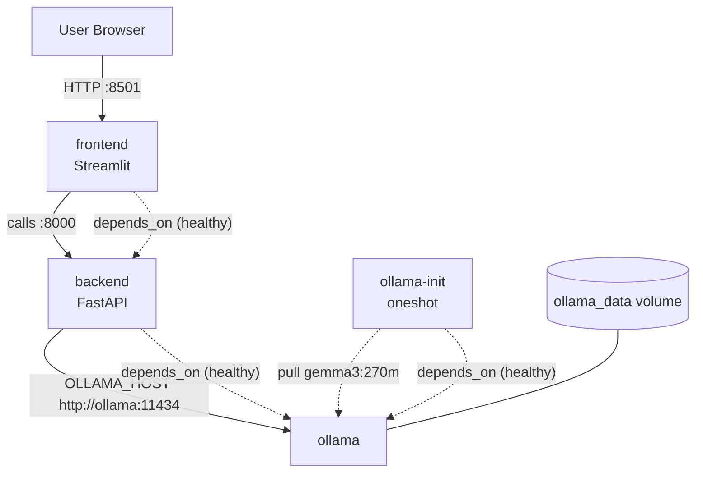

# Containers and Docker Compose

This project includes two Docker Compose setups and per-service Dockerfiles. Use the Make targets to keep commands short and consistent.

- `docker-compose.yml`: uses prebuilt registry images; production-like
- `docker-compose-local.yml`: builds backend/frontend locally from the Dockerfiles

## Services & Ports
- Services:
    - **ollama**: Runs the Ollama server; persists models in `ollama_data` (`/root/.ollama`).
    - **backend**: FastAPI app at port 8000; depends on healthy Ollama; health: `GET /health`.
    - **frontend**: Streamlit UI at port 8501; depends on healthy backend.
    - **ollama-init**: One-shot helper that pulls `gemma3:270m` after Ollama is healthy.
- Ports:
    - `11434` → Ollama (bound to `127.0.0.1` in Compose)
    - `8000` → Backend API (`0.0.0.0:8000`)
    - `8501` → Frontend (`0.0.0.0:8501`)
- Health and startup order: `depends_on` + healthchecks gate readiness.
- Persistence: `ollama_data` volume stores downloaded models across restarts.

## Architecture (Mermaid)

## Environment and Secrets
- Backend uses `OLLAMA_HOST=http://ollama:11434` internally.
- `APP_DEBUG=false` for production-like runs.
- Streamlit secrets:
    - Local dev: mount `./src/frontend/.streamlit/secrets.toml` → `/app/.streamlit/secrets.toml` (read-only).
    - Never commit secrets.

## Local Development (Compose builds images locally)
- Build and run: `make local-up`
- Stop: `make local-down`
- Tail logs: `make local-logs`
- What it does:
    - Builds images from `src/backend/Dockerfile` and `src/frontend/Dockerfile`.
    - Mounts Streamlit secrets for the frontend (if present).
    - Pulls the small `gemma3:270m` model via `ollama-init`.

## Production-like (Use Registry Images)
- Start services in the background: `make compose-up`
- Stop services: `make compose-down`
- Tail logs: `make compose-logs`
- Images:
    - `docker-compose.yml` references GHCR images:
        - `ghcr.io/mlops-2526q1-mds-upc/tikka-backend:latest`
        - `ghcr.io/mlops-2526q1-mds-upc/tikka-frontend:latest`
    - Ollama: `ollama/ollama:latest` from Docker Hub.
    - Makefile push targets publish to GHCR:
        - `make push-frontend-docker`
        - `make push-backend-docker`

## CI/CD, Multi-Arch Builds, and VM Rollout
- Build & Deploy (GitHub Actions): `.github/workflows/deploy.yml`
    - Triggers on pushes to `main`.
    - Steps: Setup QEMU/Buildx → auth GHCR/GCP → build backend/frontend (multi-arch) with model download via secret → push images → SSH to VM to run `run.sh` (pull + restart services) → post-deploy API verification.
    - Tags: `latest` and short SHA.
- Tests (Code + API): `.github/workflows/tests.yml`
    - Unit tests: `uv sync` + `make test`.
    - Bruno API tests against deployed environment run post-deploy in `deploy.yml`.
- Docs Validation: `.github/workflows/docs.yml`
    - Regenerates OpenAPI via `make api-docs`; fails if `docs/docs/api.html` is outdated; builds MkDocs site and uploads artifact.
- Multi-arch: Docker Buildx + QEMU produce `linux/amd64` and `linux/arm64` images.
- Registry:
    - `ghcr.io/mlops-2526q1-mds-upc/tikka-backend`
    - `ghcr.io/mlops-2526q1-mds-upc/tikka-frontend`

## Production Compose Services (Summary)
- `ollama`:
    - Image: `ollama/ollama:latest`
    - Env: `OLLAMA_HOST=0.0.0.0`
    - Volume: `ollama_data:/root/.ollama`
    - Healthcheck: `ollama list`
    - Restart: `unless-stopped`
- `backend`:
    - Image: `ghcr.io/mlops-2526q1-mds-upc/tikka-backend:latest`
    - Env: `OLLAMA_HOST=http://ollama:11434`, `APP_DEBUG=${APP_DEBUG:-false}`
    - Depends on: `ollama` healthy
    - Healthcheck: GET `http://127.0.0.1:8000/health`
    - Restart: `unless-stopped`
- `frontend`:
    - Image: `ghcr.io/mlops-2526q1-mds-upc/tikka-frontend:latest`
    - Ports: `0.0.0.0:8501:8501`
    - Depends on: `backend` healthy
    - Restart: `unless-stopped`
- `ollama-init`:
    - Image: `ollama/ollama:latest`
    - Env: `OLLAMA_HOST=http://ollama:11434`
    - Depends on: `ollama` healthy
    - Entrypoint: `ollama pull gemma3:270m`
    - Restart: `no`
- Volumes:
    - `ollama_data: { driver: local }`

## VM Deployment Details
- Deploy script on VM: `~/run.sh` performs stop → cleanup → prune → pull → up in `~/tikkamasalai` folder, then validates health checks.
- Nginx config: `~/tikkamasalai/nginx/conf.d/default.conf` mounted into the container; Certbot volumes `./certbot/www` and `./certbot/conf`.
- TLS: Certs under `/etc/letsencrypt/live/tikkamasalai.tech-0001/` used for app and API server blocks.

## See Also
- Deployment strategy, registry rollout, and API details: [Deployment](./deployment.md)