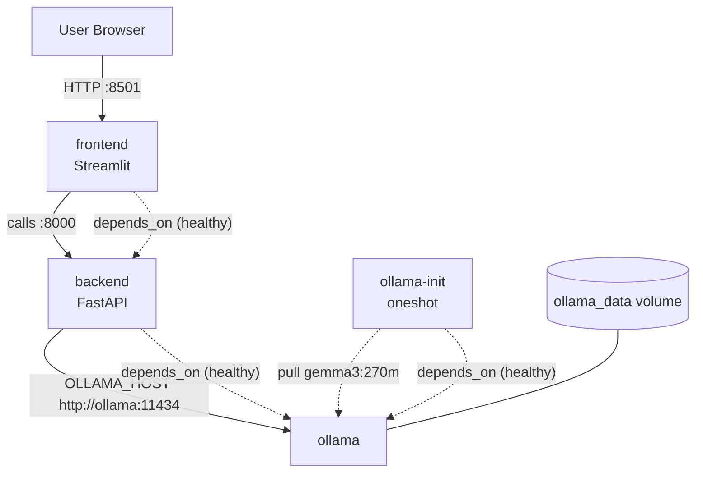

# Containers and Docker Compose

This project includes two Docker Compose setups and per-service Dockerfiles. Use the Make targets to keep commands short and consistent.

- `docker-compose.yml`: uses prebuilt registry images; production-like
- `docker-compose-local.yml`: builds backend/frontend locally from the Dockerfiles

## Services

- **ollama**: Runs the Ollama server and persists models in the ollama_data volume (mapped to /root/.ollama). Exposes 11434 on localhost.
- **backend**: FastAPI app at port 8000. Depends on a healthy ollama. Health endpoint: GET /health.
- **frontend**: Streamlit UI at port 8501. Depends on a healthy backend.
- **ollama-init**: One-shot helper that pulls gemma3:270m after ollama is healthy.

## Ports
- **11434** -> Ollama (bound to 127.0.0.1 in compose)
- **8000** -> Backend API (0.0.0.0:8000)
- **8501** -> Frontend (0.0.0.0:8501)

#### Health and startup order
- Services use depends_on with healthchecks so startup waits appropriately.

#### Persistence
- ollama_data volume stores downloaded models across restarts.

## Architecture (Mermaid)

## Environment and secrets

- OLLAMA_HOST: backend uses http://ollama:11434 internally.
- APP_DEBUG: set to false for production-like runs.
- Streamlit secrets: 
    - for local dev
    - docker-compose-local mounts ./src/frontend/.streamlit/secrets.toml into /app/.streamlit/secrets.toml (read-only)
    - Do not commit secrets.

## Local development (build images with docker-compose locally)
- Build and run: `make local-up`
- Stop: `make local-down`
- Tail logs: `make local-logs`

What it does

- Builds images from src/backend/Dockerfile and src/frontend/Dockerfile
- Mounts Streamlit secrets for the frontend (if present)
- Pulls the small gemma3:270m model via ollama-init

## Production-like (use registry images)

- Start services in the background: `make compose-up`
- Stop services: `make compose-down`
- Tail logs: `make compose-logs`

#### Images
- docker-compose.yml references prebuilt images hosted on GHCR for our services: 
    - ghcr.io/mlops-2526q1-mds-upc/tikka-backend:latest and 
    - ghcr.io/mlops-2526q1-mds-upc/tikka-frontend:latest
- The upstream Ollama image is pulled from Docker Hub (ollama/ollama:latest).
- The Makefile push targets publish to GHCR (ghcr.io/mlops-2526q1-mds-upc).
    - `push-frontend-docker` to build and push the frontend.
    - `push-backend-docker` to build and push the backend.